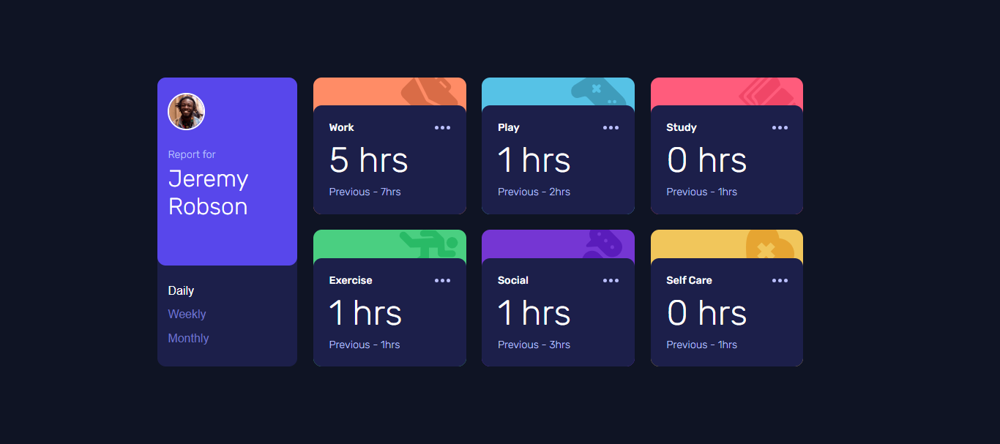
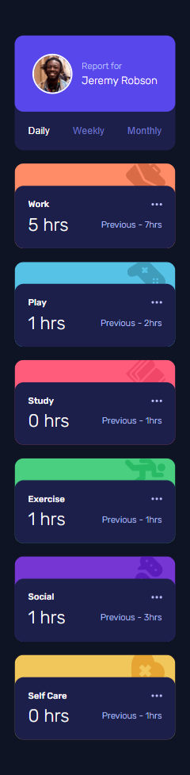

# Frontend Mentor - Time tracking dashboard solution

This is a solution to the [Time tracking dashboard challenge on Frontend Mentor](https://www.frontendmentor.io/challenges/time-tracking-dashboard-UIQ7167Jw). Frontend Mentor challenges help you improve your coding skills by building realistic projects. 

## Table of contents

  - [The challenge](#the-challenge)
  - [Screenshot](#screenshot)
  - [Links](#links)
  - [Built with](#built-with)
  - [What I learned](#what-i-learned)
  - [Continued development](#continued-development)
  - [Useful resources](#useful-resources)
  - [AI Collaboration](#ai-collaboration)
  - [Author](#author)


### The challenge

Users should be able to:

- View the optimal layout for the site depending on their device's screen size
- See hover states for all interactive elements on the page
- Switch between viewing Daily, Weekly, and Monthly stats

### Screenshot





### Links

- Solution URL: (https://github.com/nouranelfar/Time-tracking-dashboard)
- Live Site URL: (https://nouranelfar.github.io/Time-tracking-dashboard/)

### Built with

- Semantic HTML5 markup
- CSS custom properties
- Flexbox
- Sass
- Mobile-first workflow


### What I learned

```css
@mixin activity-bg($icon, $color, $position) {
    background: url($icon), $color;
    background-repeat: no-repeat;
    background-position: $position;
}

.work{
    @include activity-bg("./assets/images/icon-work.svg", var(--Orange-300), 92% -10%)
}

.play{
    @include activity-bg("./assets/images/icon-play.svg", var(--Blue-300), 92% -5%)
}

.study{
    @include activity-bg("./assets/images/icon-study.svg",var(--Pink-400) , 92% -8%)
}

.exercise{
    @include activity-bg("./assets/images/icon-exercise.svg",var(--Green-400) , 92% 0)
}

.social{
    @include activity-bg("./assets/images/icon-social.svg", var(--Purple-700), 92% -15%)
}

.self_care{
    @include activity-bg("./assets/images/icon-self-care.svg", var(--Yellow-300), 92% -8%)
}
``

```js
async function getPosts(){
    const result = await fetch("./data.json");
    const data = await result.json();

    return{

        dailyScore: function (){
            for(let i = 0; i < data.length ; i++){
                let current = data[i].timeframes.daily.current;
                hours[i].textContent = ` ${current} hrs`;

                let previous = data[i].timeframes.daily.previous;
                total[i].textContent = `Previous - ${previous}hrs`;
            }
        },

        weeklyScore: function (){
            for(let i = 0; i < data.length ; i++){
                let current = data[i].timeframes.weekly.current;
                hours[i].textContent = ` ${current} hrs`;

                let previous = data[i].timeframes.weekly.previous;
                total[i].textContent = `Last Week - ${previous}hrs`;
            }
        },

        monthlyScore: function (){
            for(let i = 0; i < data.length ; i++){
                let current = data[i].timeframes.monthly.current;
                hours[i].textContent = ` ${current} hrs`;

                let previous = data[i].timeframes.monthly.previous;
                total[i].textContent = `Last Month - ${previous}hrs`;
            }
        }
    };

}
```


### Useful resources

- [Example resource 1](https://developer.mozilla.org/en-US/docs/Learn_web_development/Extensions/Forms/Form_validation) - This helped me in validation functions.
- [javascript info](https://javascript.info/) - This is an amazing article which helped me understand java script basics.
- [sass] (https://sass-lang.com/guide/) - this helped me styling with saas.


### AI Collaboration

- What tools did i use ? (ChatGPT)
- How did you i them ? (debugging)

## Author
- Frontend Mentor - [@nouranelfar](https://www.frontendmentor.io/profile/nouranelfar)
- linkedIn - [nouran elfar] (https://www.linkedin.com/in/nouran-elfar-b5a0a3362/)
